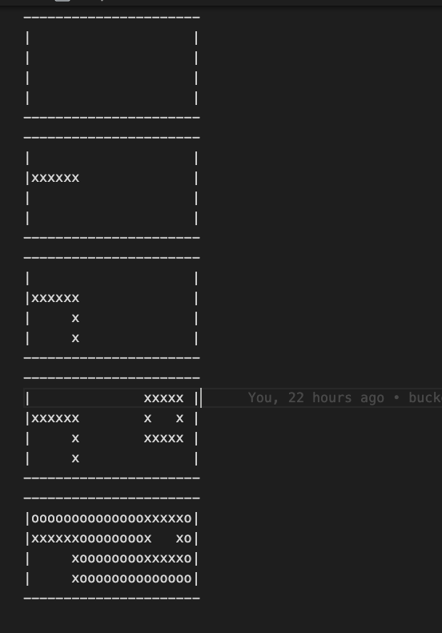

# canvas-drawing
 #Basic functionality read the commands from input.txt and if the commands are valid then produce output in the output.txt
    
    1. Read commands using - readFile - store in an array.
    2. Pass the commands with forEach loop into the checkInput function.
    3. Identify the command and check validity if pass create canvas store the output in the 2dimensional array.
    4. then create other shapes after validation and update output in the 2 dimensional array.
    5. For bucket fill - start with coloring the given point then explore the adjacent point if they are valid color them and take one of them explore its adjacent point and color them continue this process until valid points end and color all the need points.

    Validation Check
        1. Check if the commands are valid if not throw error
        2. Check canvas before creating shape if canvas does not exist throw error
        3. Check if all the points lies inside the canvas if not throw error
        4. In create line - check if the points are for verticle or horizontal  line if not throw error.

input =>
        C 20 4  
        L 1 2 6 2 
        L 6 3 6 4 
        R 15 1 19 3 
        B 10 3 o 

output =>

